<!-- markdownlint-disable MD033 -->

# 스크린샷 (htdocs 기능 기준)

## 1. 메인 페이지

- 관련 코드: `htdocs/index.php`, `htdocs/page/main.php`
- 메인 슬라이드 배너, 로그인 박스, MOOC 소개, 공지사항 요약, 강좌 카드(자세히 보기) 영역을 보여줍니다.

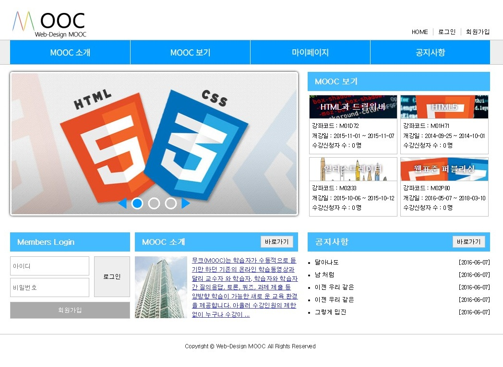

## 2. 회원가입 / 로그인 다이얼로그

- 관련 코드: `htdocs/include/login.php`, `htdocs/include/join.php`
- 다이얼로그 기반 인증 UI와 회원가입 입력 흐름을 보여줍니다.

  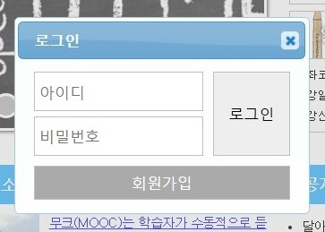
  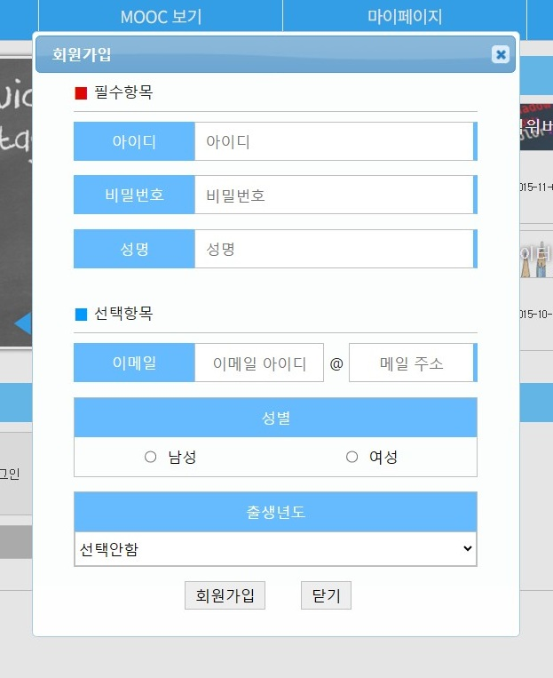

## 3. MOOC 소개

- 관련 코드: `htdocs/page/main1/sub1/index.php`
- MOOC 개념 설명, FAQ, 안내 텍스트 등 소개 콘텐츠 화면을 보여줍니다.

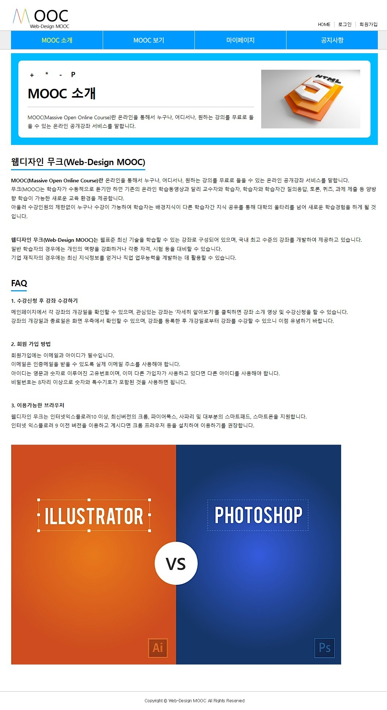

## 4. 강좌 목록 / 수강 신청

- 관련 코드: `htdocs/page/main2/sub1/index.php`, `htdocs/page/main2/sub1/list.php`, `htdocs/page/main2/sub1/educate.php`, `htdocs/page/main2/sub1/educate_ok.php`, `htdocs/include/join.php`, `htdocs/include/join_ok.php`
- 강좌 목록 조회와 상세 다이얼로그를 제공하며, 로그인 사용자는 `educate_ok.php`, 비로그인 사용자는 회원가입(`join.php` -> `join_ok.php`) 경로로 수강 신청이 처리됩니다.

  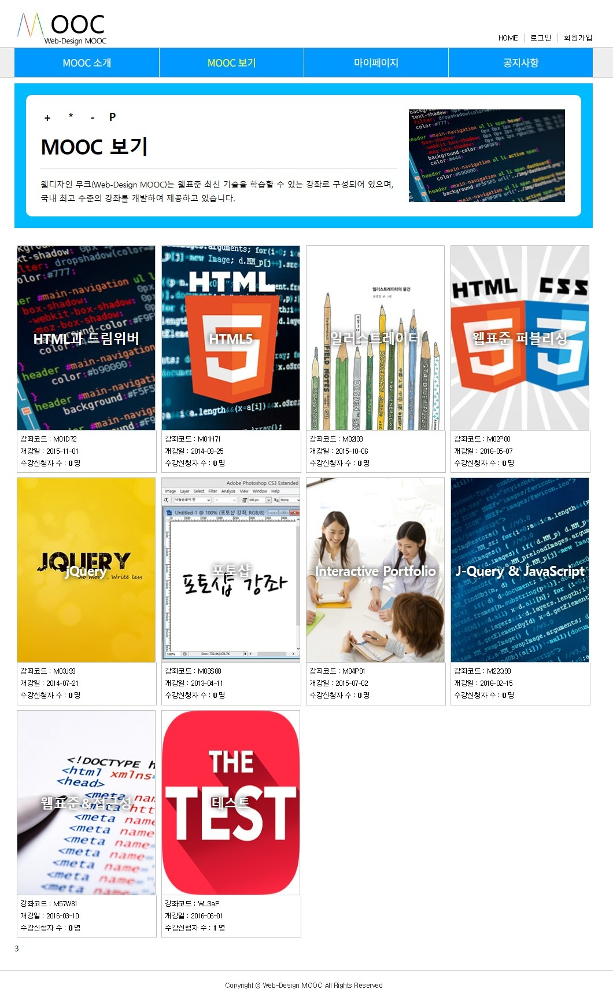
  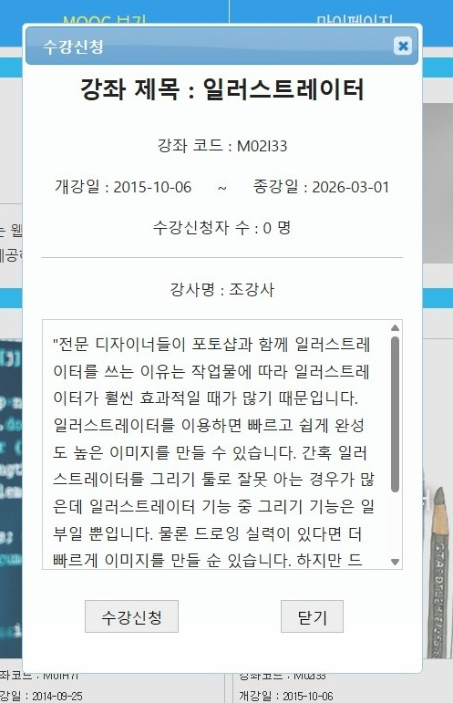

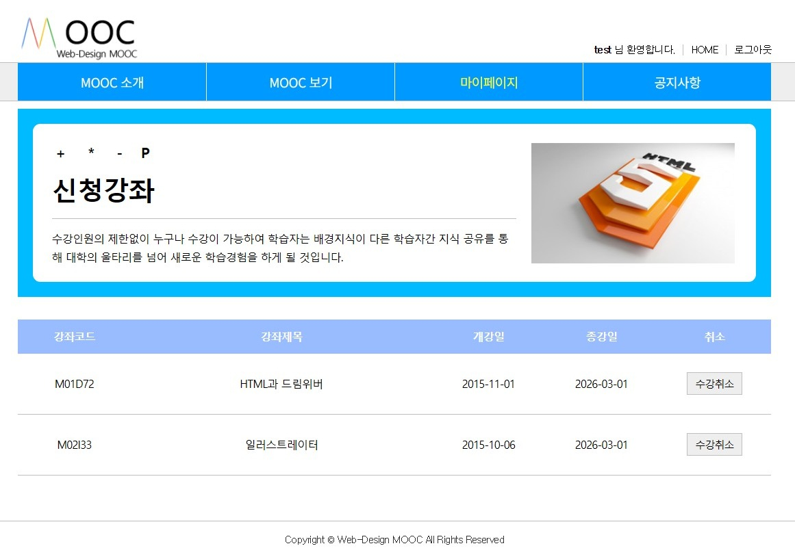

## 5. 공지사항 / 댓글

- 관련 코드: `htdocs/page/main4/sub1/index.php`, `htdocs/page/main4/sub1/view.php`, `htdocs/page/main4/sub1/comment.php`
- 공지 목록(비동기 로딩), 본문 확장, 댓글 작성/조회 인터랙션을 보여줍니다.

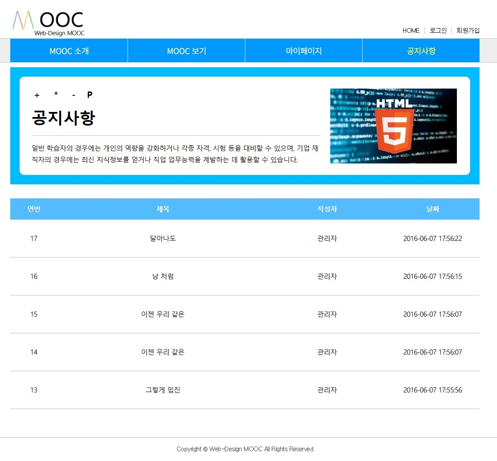
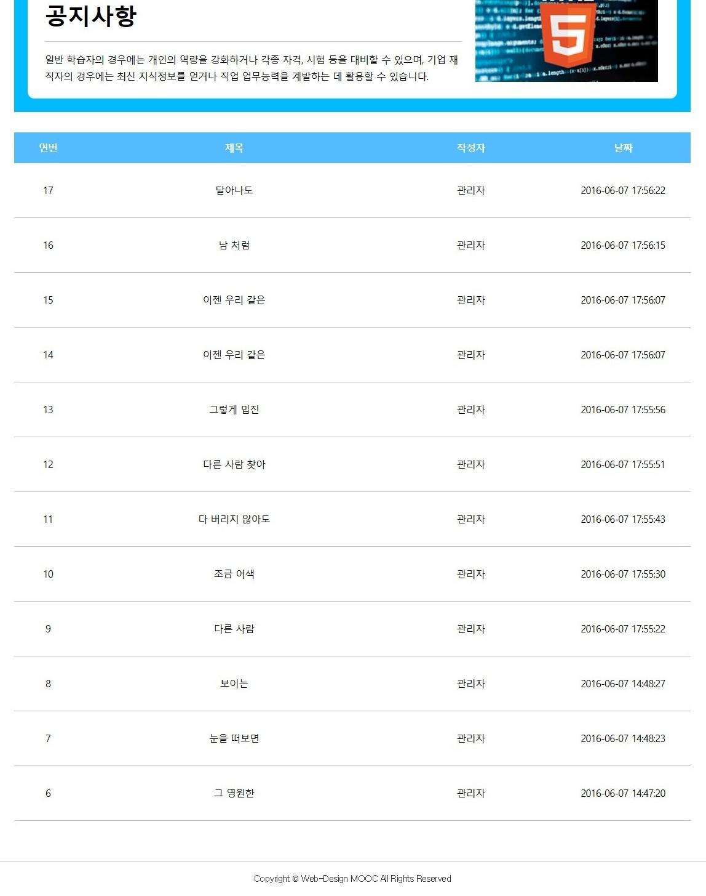

## 6. 관리자 강좌 관리

- 관련 코드: `htdocs/page/admin/sub1/index.php`
- 강좌 추가/수정/삭제, 신청자 수 확인, TXT/CSV/XML 다운로드 기능(`file_download_code.php`, `download.php`)을 보여줍니다.

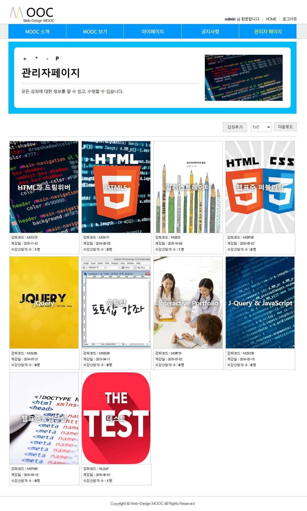

  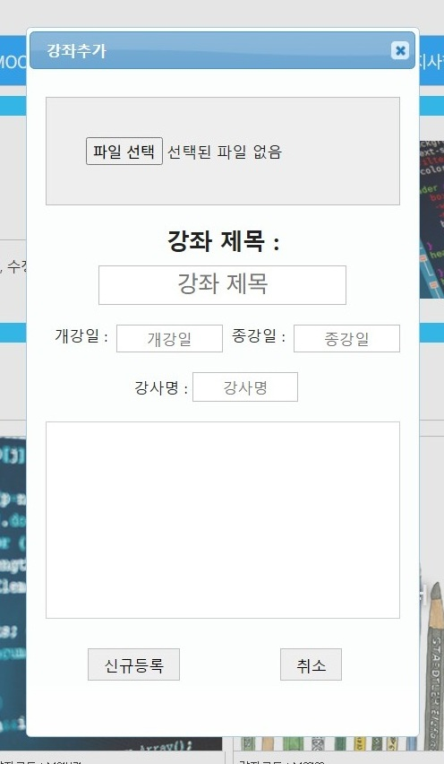
  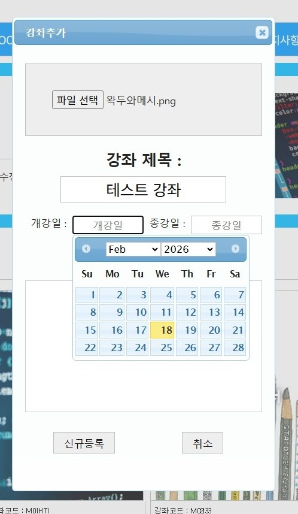
  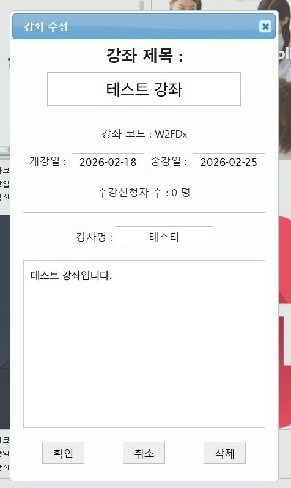

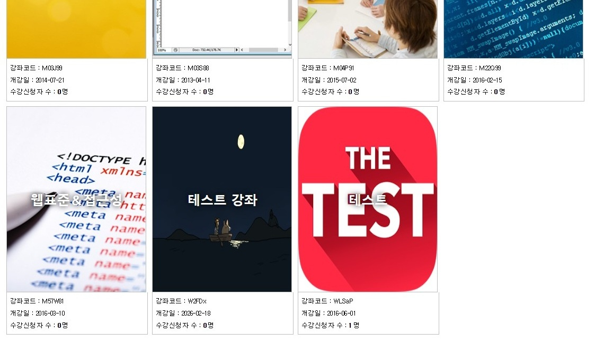
