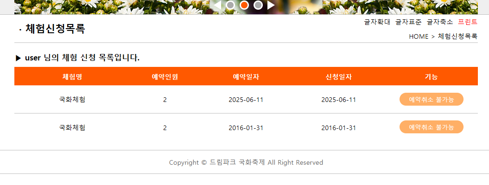

# 2015년도 지방기능경기대회 웹디자인 및 개발

## 개요

본 사이트는 “드림파크 국화축제”라는 축제를 알리고, 방문객들에게 축제와 국화 정보를 제공 하며 온라인 체험 예매 서비스를 제공하기 위해 제작된 사이트 이다. 웹 표준을 준수하여 다양한 사용자들이 편리하게 접근이 가능하도록 사이트의 성격을 잘 파악하여 기획하고 제작하여야 한다.

- [과제 요구사항 참고](https://github.com/JuheonOh/webskills/blob/2015_%EC%A7%80%EB%B0%A9/2015%20%EC%A7%80%EB%B0%A9%EA%B8%B0%EB%8A%A5%EA%B2%BD%EA%B8%B0%EB%8C%80%ED%9A%8C%20%EA%B3%BC%EC%A0%9C%20%EB%B0%8F%20%EC%B1%84%EC%A0%90%EA%B8%B0%EC%A4%80%ED%91%9C.pdf)

## 스크린샷

### 메인 페이지

### 회원가입

### 체험신청

### 커뮤니티

