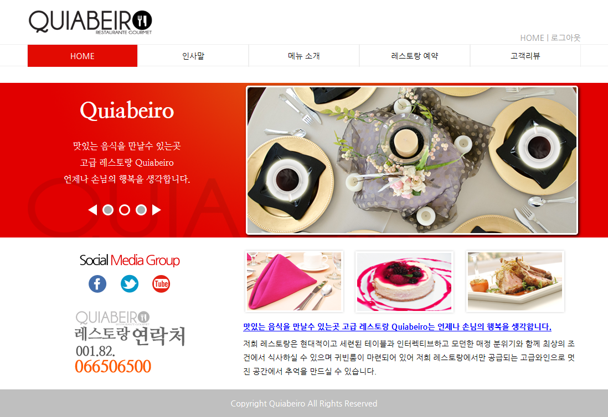
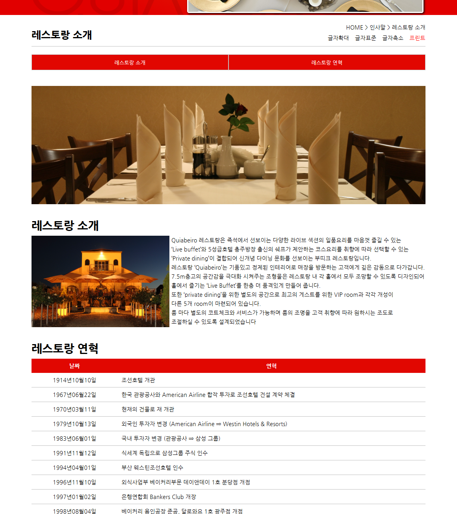
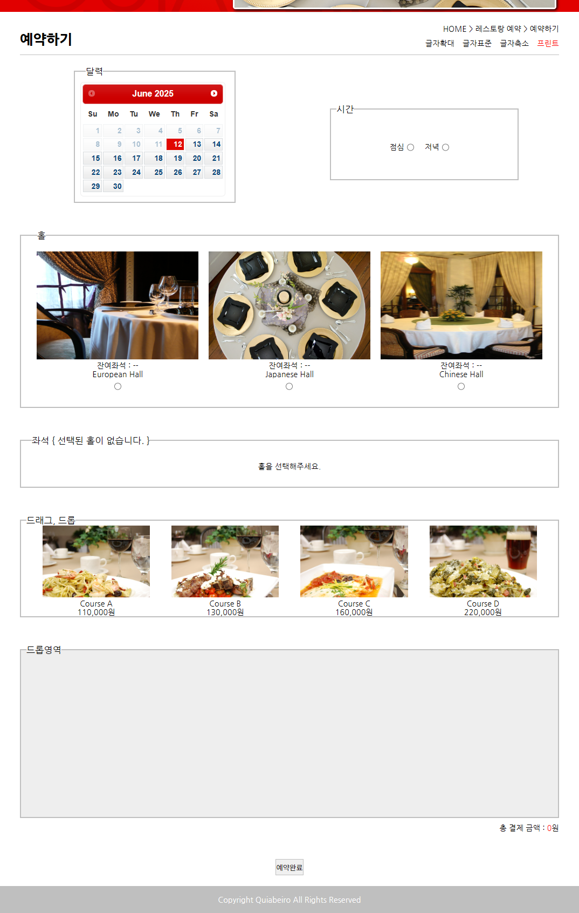
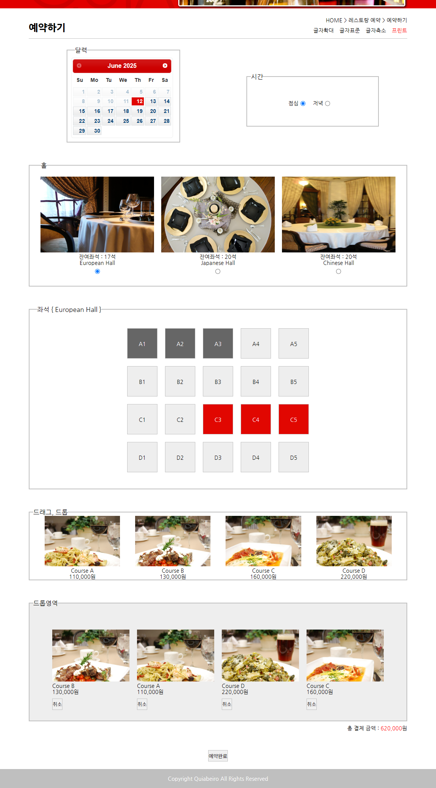
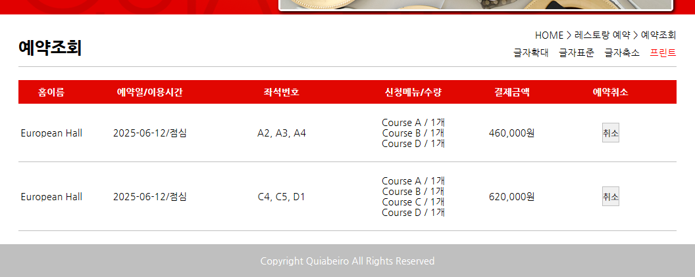
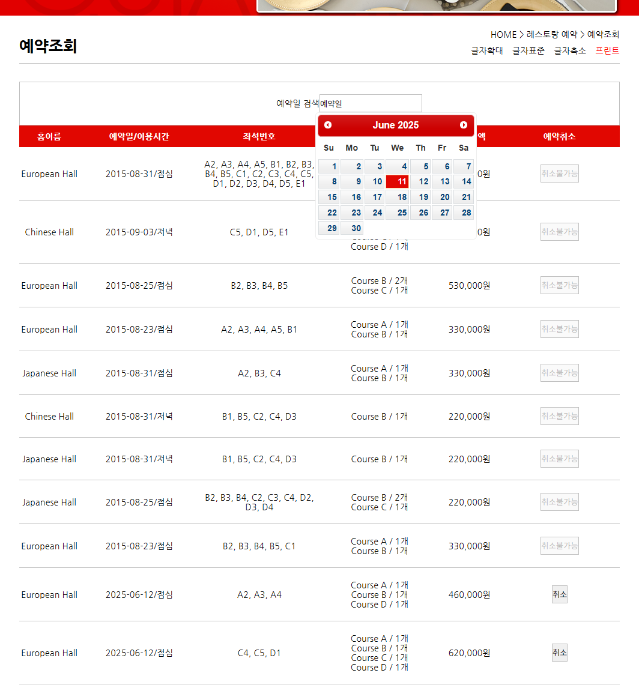
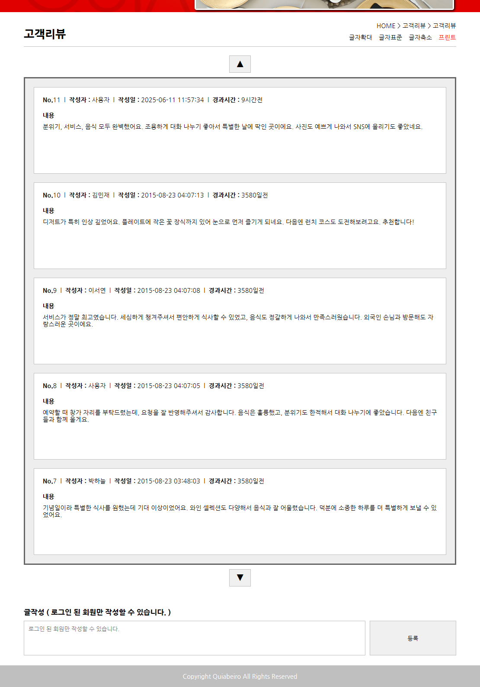

# 2015년도 전국기능경기대회 웹디자인 및 개발 과제 풀이

## 개요

본 사이트는 고객에게 편리한 레스토랑 예약 서비스를 제공하기 위해 제작 의뢰된 레스 토랑 웹사이트인 **"Quiabeiro Restaurante Gourmet"** 이다. 고급 레스토랑의 현대적이고 세련된 디자인과 인터랙티브하고 시대적 흐름에 부합하는 사용자 중심의 편리한 웹사이트 구성을 통해 고객과의 관계를 효과적으로 주도하고 방문자의 유도를 극대화 할 수 있도록 기획하고 제작하여야 한다.

## 스크린샷

### 메인 페이지

### 레스토랑 소개

### 예약하기

### 예약조회 (일반 사용자)

### 예약조회 (관리자)

### 고객리뷰

