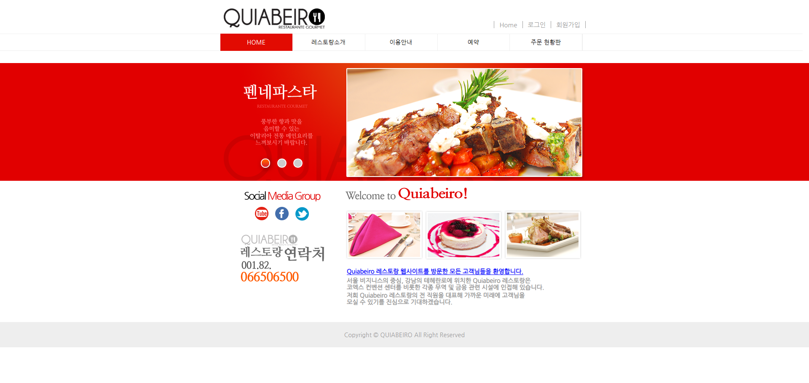
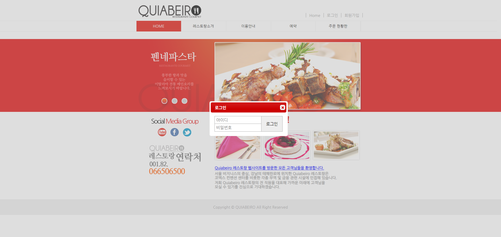
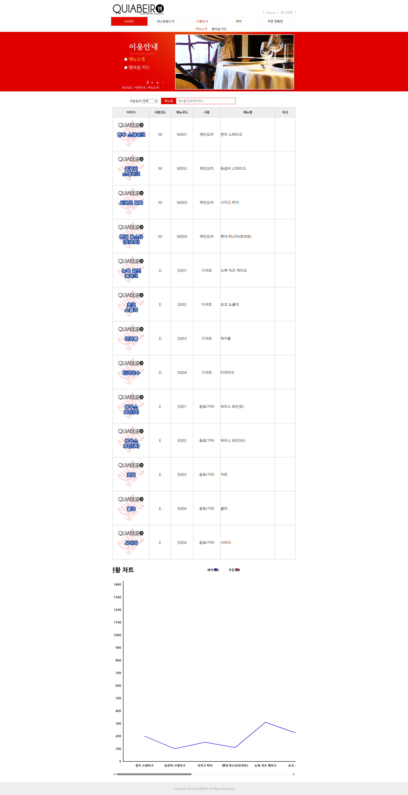
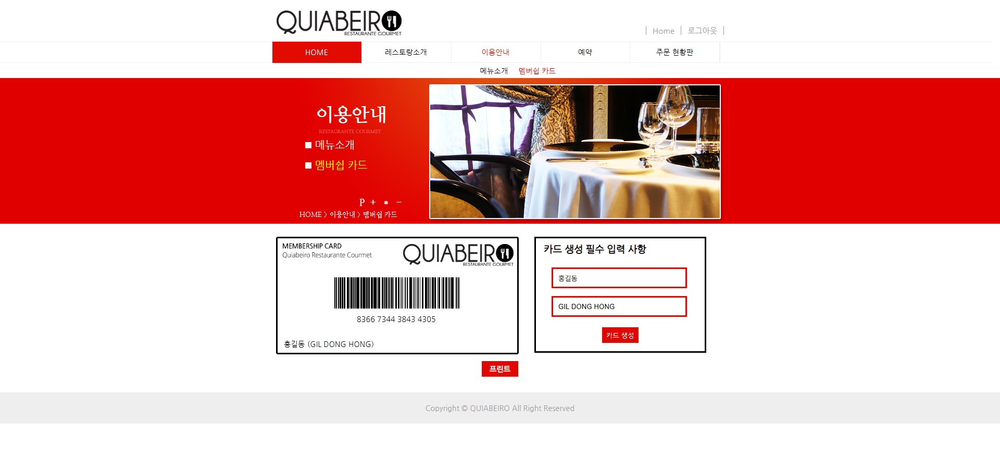
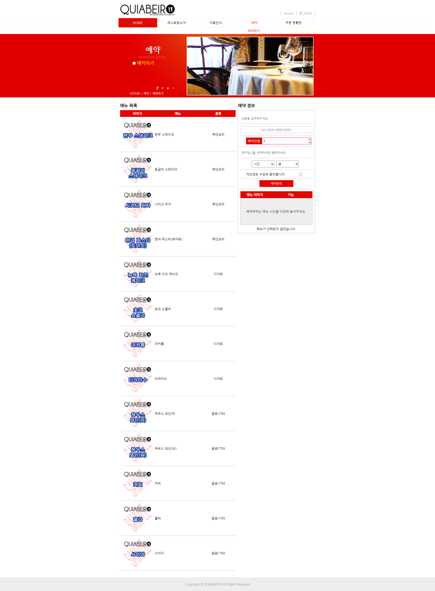
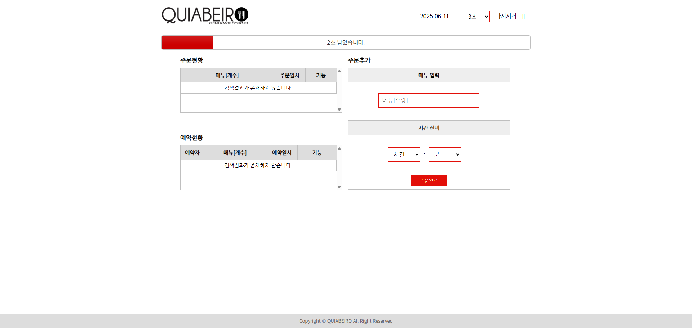

# 2015년도 전국기능경기대회 웹디자인 및 개발 과제 풀이

## 개요

이  프로젝트의  목적은  브라질의  떠오르는  도시  중  하나인  Belo  Horizonte에  있는  가상의  레스토랑을  위한  웹사이트를  개발하는  것이다.  고객(레스토랑  경영자)는  현대적이며  세련된  디자인과  인터랙티브하고  시대적  흐름에  부합하는  웹사이트를  개설하여  자신들이  고객과의  관계를 효과적으로 주도하고 방문자를 유도할 수 있도록 제작 하여야 한다.

- [과제 요구사항 참고](https://github.com/JuheonOh/webskills/blob/2015_%EC%A0%84%EA%B5%AD/gwangju/task/(%EA%B4%91%EC%A3%BC)%202015%20%EC%A0%84%EA%B5%AD%EA%B8%B0%EB%8A%A5%EA%B2%BD%EA%B8%B0%EB%8C%80%ED%9A%8C%20%EA%B3%BC%EC%A0%9C%20%EB%B0%8F%20%EC%B1%84%EC%A0%90%EA%B8%B0%EC%A4%80%ED%91%9C.pdf)

## 스크린샷

### 메인 페이지

### 메뉴소개

### 멤버쉽 카드

### 예약하기

### 주문 현황판

