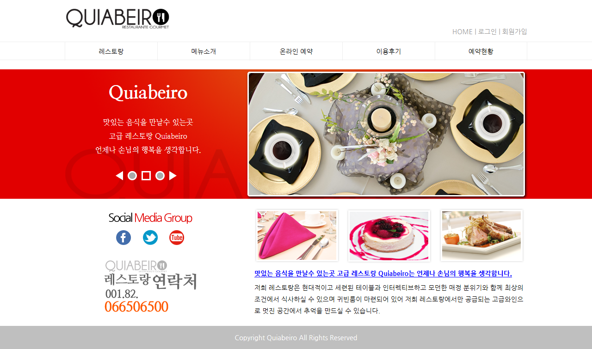
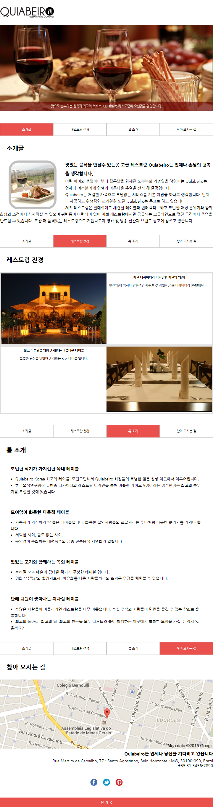
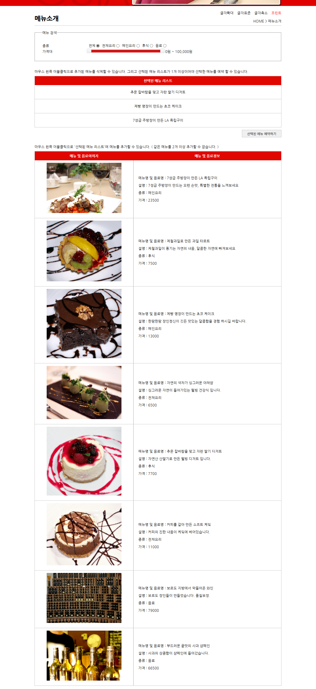
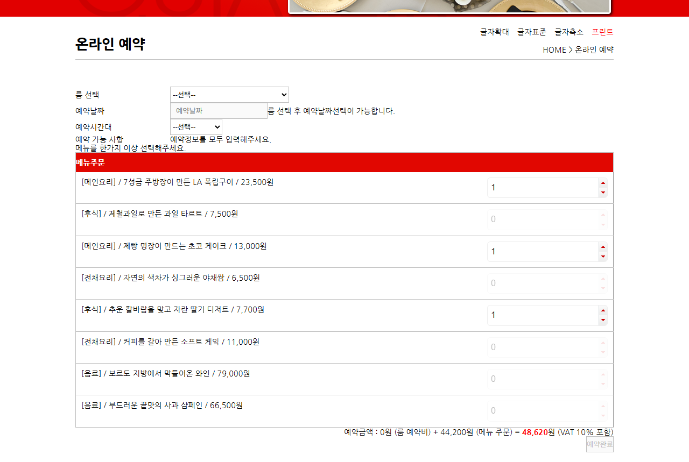
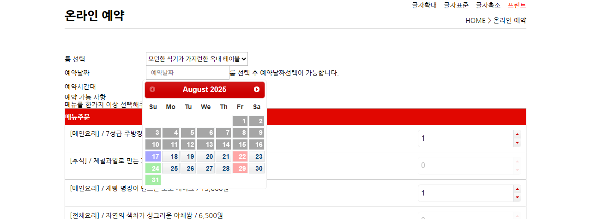
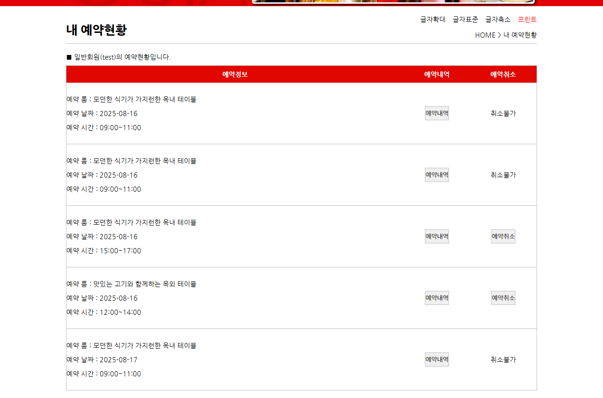
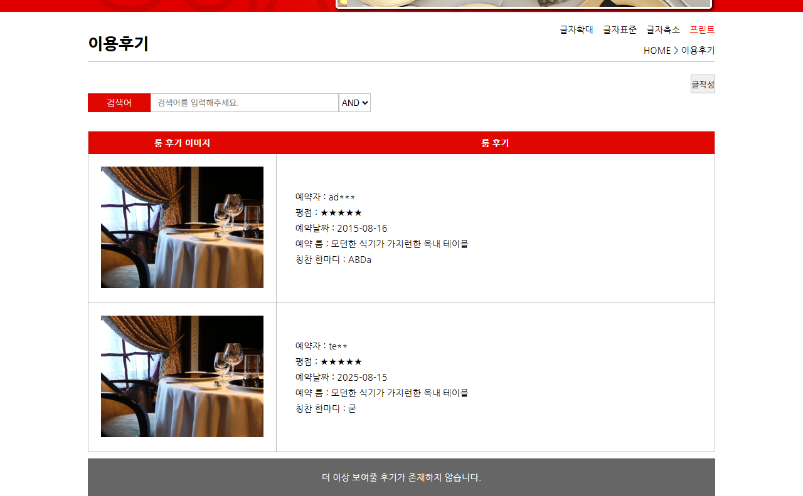
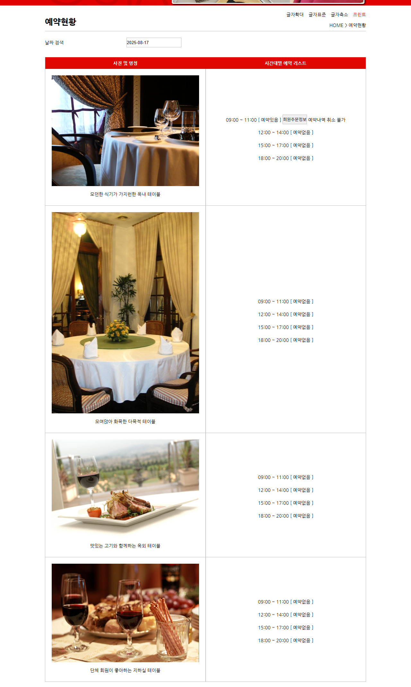
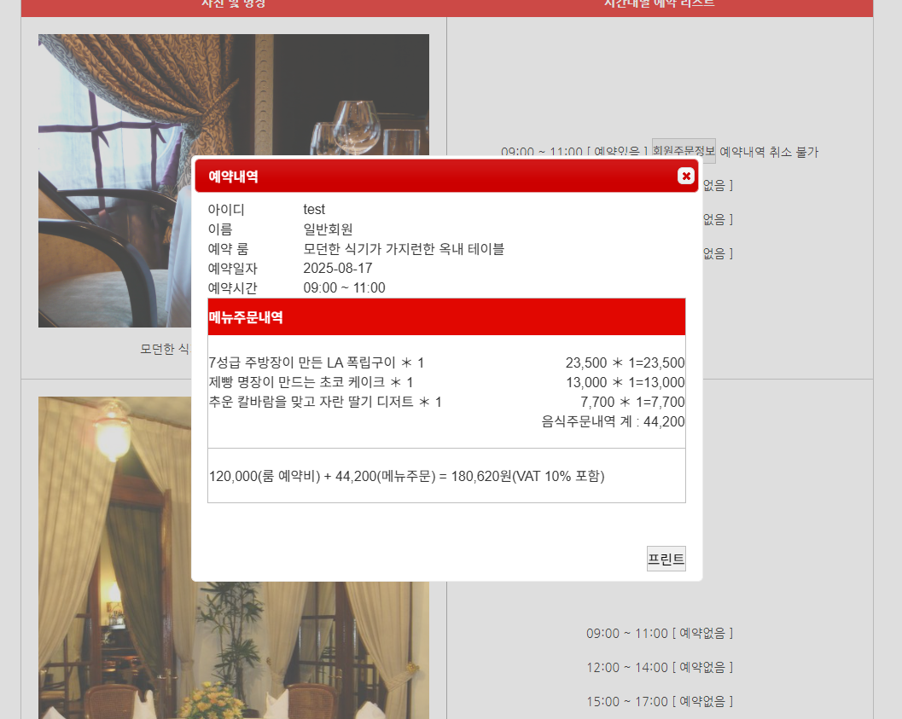

# 2015년도 전국기능경기대회 웹디자인 및 개발 과제 풀이

## 개요

본 웹 사이트는 레스토랑을 온라인으로 소개하고, 예약할 수 있는 ‘Quiabeiro Restaurante Gourmet’ 사이트 이다. 웹 표준과 웹 접근성을 준수하여 PC 사용자, Smartphone 사용자, Tablet PC의 사용자, 장애인 사용자등 다양한 사용자들에게 편리하게 접근이 가능하도록 본 사이트의 성격을 잘 파악하여 기획하고, 홈페이지를 제작한다.

- [과제 요구사항 참고](https://github.com/JuheonOh/webskills/blob/2015_%EC%A0%84%EA%B5%AD/gyeonggi/task/(%EA%B2%BD%EA%B8%B0)%202015%20%EC%A0%84%EA%B5%AD%EA%B8%B0%EB%8A%A5%EA%B2%BD%EA%B8%B0%EB%8C%80%ED%9A%8C%20%EA%B3%BC%EC%A0%9C%20%EB%B0%8F%20%EC%B1%84%EC%A0%90%EA%B8%B0%EC%A4%80%ED%91%9C.pdf)

## 스크린샷

### 메인 페이지

### 레스토랑

### 메뉴소개

### 온라인 예약

### 내 예약현황

### 이용후기

### 예약현황

